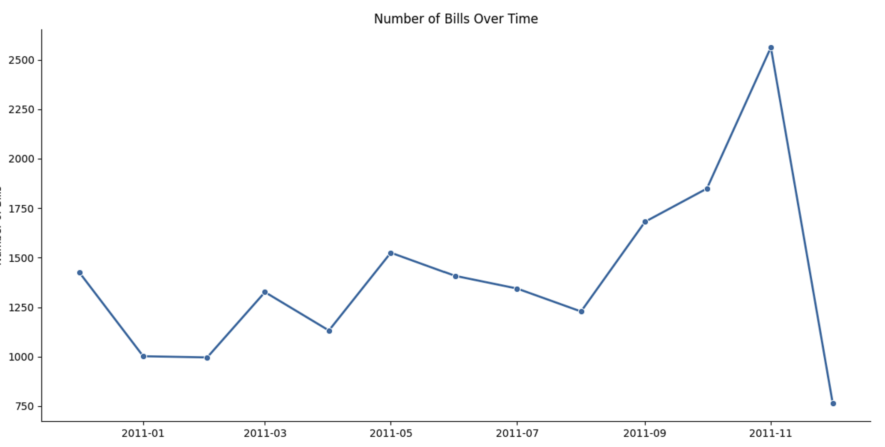
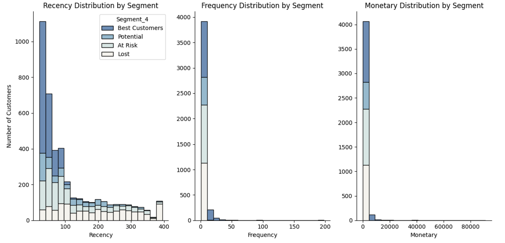
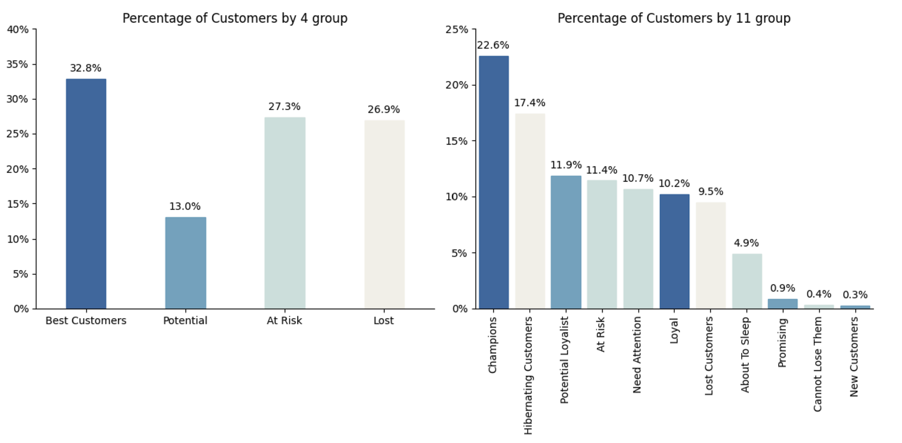
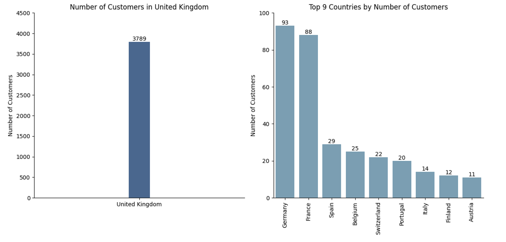
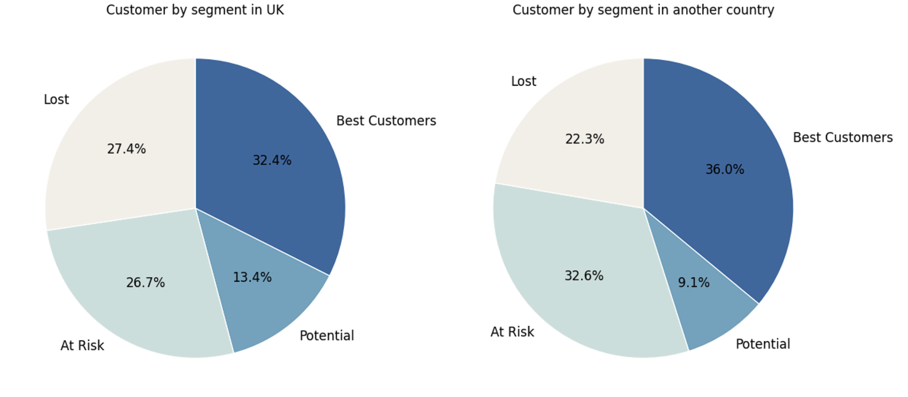

# 🎯 Customer Segmentation with RFM Analysis (Python)

**Author:** [Your Name] · Data Analyst / Business Analyst Intern Candidate

[](https://www.python.org/)
[](https://colab.research.google.com/)

> An end-to-end RFM (Recency – Frequency – Monetary) customer segmentation project in Python, built to help a marketing team target the right campaigns at the right customer groups for a global retail company.

👉 **[Open the full notebook in Google Colab](https://colab.research.google.com/drive/1qGy6p6QNDT_TaQ3iAuInlkEPK-QaXeLP?usp=sharing)**

---

## 📖 Introduction

**SuperStore** is a global retail company. Heading into the Christmas/New Year season, the Marketing team wanted to run loyalty campaigns to thank existing customers and identify high-potential customers worth nurturing into loyal buyers. In previous years, with a smaller customer base, segmentation was done manually in Excel — but the dataset had grown too large for that approach.

The Marketing Director proposed using the **RFM (Recency – Frequency – Monetary)** model, and asked the Data team to build this segmentation as a **Python pipeline** instead, so it could scale and be reused for future campaigns.

The dataset used is transaction-level data from SuperStore's **UK market** (Dec 2010 – Dec 2011) — used as the worked example here since the UK is SuperStore's single largest market by customer volume among all countries it operates in.

---

## 🛠️ What I Did (Steps)

1. **Prepared the dataset** for RFM — cleaned transaction data, removed cancelled orders and invalid rows.
2. **Calculated R, F, M for each customer** — Recency (days since last purchase, measured from the reference date **31/12/2011**), Frequency (number of purchases), Monetary (total spend).
3. **Scored each metric from 1–5** using the **quintile method** (a standard statistical 5-way split), so customers are ranked relative to each other.
4. **Grouped customers into segments** based on their combined RFM scores — both a simplified **4-group model** (Best Customers / Potential / At Risk / Lost) and a more granular **11-group model** (Champions, Loyal, Hibernating, etc.).
5. **Visualized segment sizes and distributions** across different dimensions (RFM values, country).
6. **Analyzed the current state** of SuperStore's customer base and turned it into concrete suggestions for Marketing.
7. **Answered which of R, F, or M** matters most for a retail business model like SuperStore's.

📄 Full code and execution: **[Google Colab notebook](https://colab.research.google.com/drive/1qGy6p6QNDT_TaQ3iAuInlkEPK-QaXeLP?usp=sharing)**

---

## 📊 Results & Insights

### Monthly transaction volume



Order volume trended generally upward through the year, dipping to a low around Feb 2011 (~1,000 bills) and building steadily toward a strong peak in **November 2011 (~2,570 bills)** — consistent with pre-Christmas seasonal buying. The sharp drop after November reflects the dataset's cutoff (transactions only recorded through early December 2011), not an actual collapse in demand.

---

### RFM distribution by segment



Both the Frequency and Monetary distributions are **heavily right-skewed** — most customers cluster near the low end (under ~10 orders, under ~£5,000 spent), with a long thin tail of high-value outliers. This is typical retail behavior: a small number of "whale" customers contribute disproportionately to revenue. It supports prioritizing retention spend on the **Best Customers** segment, even though they aren't the largest group by headcount.

---

### Segment sizing — 4-group vs. 11-group models



In the **4-group model**, nearly 1 in 3 customers (**32.8%**) already qualifies as a Best Customer — a strong core base to reward this campaign. But over half the base (**27.3% At Risk + 26.9% Lost = 54.2%**) has drifted away, which is the bigger red flag for Marketing.

The **11-group model** reveals something the 4-group view hides: **"New Customers" is only 0.3%** of the base — almost no fresh acquisition is happening. Combined with "Champions" (22.6%) being the single largest individual group, this suggests SuperStore's activity in this period was driven by **deepening existing relationships, not new customer acquisition**.

---

### Customer count by country



The UK dominates with **3,789 customers**, dwarfing every other market — the next largest is Germany with just 93, followed by France (88), Spain (29), and a long tail of smaller markets down to Austria (11). This confirms the UK as the right market to build and validate the RFM model on.

---

### Segment mix: UK vs. rest of world



Customers outside the UK actually convert to "Best Customers" at a slightly **higher** rate (**36.0% vs. 32.4%**) and are less likely to be "Lost" (**22.3% vs. 27.4%**) — even though they're a tiny fraction of the total customer base. This suggests international customers, while few in number, tend to be more engaged when they do convert.

---

## ✅ Recommendations for Marketing

1. **Reward, don't just acquire.** 32.8% of customers are already "Best Customers" — a Christmas loyalty/VIP campaign for this group protects SuperStore's most valuable revenue base.
2. **Win-back is the biggest opportunity.** Over half of customers (54.2%) are At Risk or Lost — a dedicated win-back campaign has the largest addressable size of any segment action available.
3. **Growth is coming from deepening relationships, not new customers.** With "New Customers" at just 0.3%, it's worth evaluating whether acquisition channels need more investment alongside retention efforts.
4. **International customers convert well despite low volume.** The higher "Best Customer" rate outside the UK suggests a focused international campaign could have outsized ROI relative to its small base.

**Which of R, F, or M matters most?** For a retail/wholesale-driven business like SuperStore, **Frequency and Monetary together matter most for identifying long-term value** — a customer who buys often and spends a lot is the core of repeat revenue. But **Recency is the most time-sensitive, actionable signal for campaign targeting** — it decays fastest and tells Marketing exactly who to reach out to *right now* before they slip further away. In practice: use **Monetary and Frequency to decide who is worth investing in**, and **Recency to decide when to act**.

---

## 📂 Repository Structure

```
rfm-customer-segmentation/
├── README.md
└── images/
    ├── 01_bills_over_time.png
    ├── 02_rfm_distribution_by_segment.png
    ├── 03_segment_percentage_4_vs_11_groups.png
    ├── 04_customers_by_country.png
    └── 05_segment_uk_vs_other_countries.png
```

> The full Python code lives in the [Google Colab notebook](https://colab.research.google.com/drive/1qGy6p6QNDT_TaQ3iAuInlkEPK-QaXeLP?usp=sharing) linked above — this repo hosts the write-up and exported results for portfolio viewing.

---

## 📬 Contact

**[Your Name]**
📧 [your.email@example.com] · 🔗 [LinkedIn](https://linkedin.com/in/yourprofile) · 💻 [GitHub](https://github.com/yourusername)
